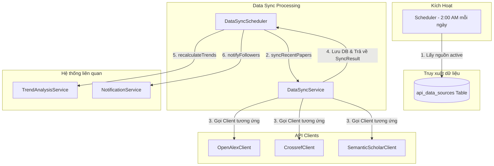
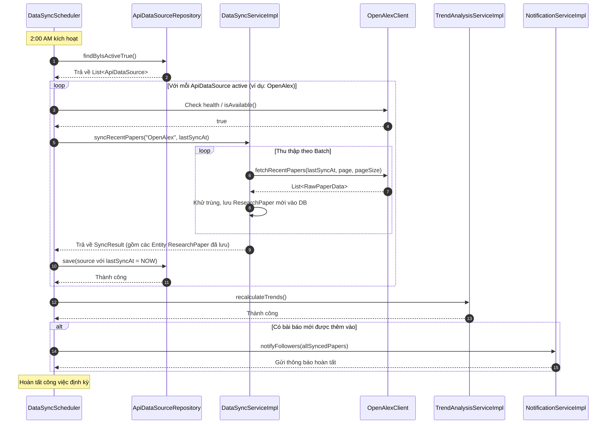

# 📑 Tài liệu Kiến trúc & Luồng hoạt động: JP-28 Data Sync Scheduler

Tài liệu này giải thích chi tiết luồng hoạt động, kiến trúc, sơ đồ tuần tự và cơ sở dữ liệu của task **JP-28: Data Sync Scheduler** tự động đồng bộ dữ liệu bài báo khoa học định kỳ từ các External APIs.

---

## 1. Vị trí và Kiến trúc của JP-28 trong Hệ thống

Phân hệ **JP-28: Data Sync Scheduler** đóng vai trò là động cơ kích hoạt tự động (Automatic Trigger Engine) của phân hệ đồng bộ dữ liệu. Nó kéo dữ liệu bài báo mới về hệ thống định kỳ mà không cần admin kích hoạt thủ công.



---

## 2. Thiết kế Cơ sở dữ liệu (`api_data_sources`)

Bảng `api_data_sources` quản lý cấu hình và trạng thái đồng bộ gần nhất của từng nguồn API bên ngoài:

```sql
CREATE TABLE api_data_sources
(
    id           BIGINT PRIMARY KEY AUTO_INCREMENT,
    name         VARCHAR(100) NOT NULL, -- Ví dụ: "OpenAlex", "Crossref", "Semantic Scholar"
    base_url     VARCHAR(500) NOT NULL, -- URL gốc của API
    api_key      VARCHAR(500),          -- Khóa API nếu có
    is_active    BOOLEAN DEFAULT TRUE,  -- Trạng thái kích hoạt (chỉ sync khi TRUE)
    last_sync_at DATETIME               -- Mốc thời gian hoàn tất đồng bộ gần nhất
);
```

### Cách thức hoạt động:
*   Mỗi khi Scheduler chạy, nó chỉ lấy các nguồn có `is_active = true`.
*   Scheduler lấy giá trị `last_sync_at` làm mốc ngày (`fromDate`) bắt đầu lấy bài báo mới. Nếu `last_sync_at` rỗng (lần chạy đầu tiên), nó mặc định lấy từ ngày hôm trước (`LocalDate.now().minusDays(1)`).
*   Sau khi một nguồn hoàn tất đồng bộ thành công, Scheduler cập nhật `last_sync_at` của nguồn đó bằng thời điểm hiện tại (`LocalDateTime.now()`).

---

## 3. Sơ đồ hoạt động (Activity Diagram)

Quy trình hoạt động tự động khi Scheduler được kích hoạt:

```mermaid
%%{init: { 'flowchart': {'useMaxWidth': false} }}%%
flowchart TD
    Start([Bắt đầu: Đạt mốc 2:00 AM]) --> CheckEnabled{sync.enabled == true?}
    
    CheckEnabled -- No --> Stop([Kết thúc])
    CheckEnabled -- Yes --> GetSources[Lấy danh sách ApiDataSource đang active từ DB]
    
    GetSources --> LoopStart{Còn ApiDataSource chưa sync?}
    
    LoopStart -- Yes --> SelectSource[Lấy ApiDataSource tiếp theo]
    SelectSource --> FindClient{Có Client tương ứng?}
    
    FindClient -- No --> LogWarning[Ghi log cảnh báo] --> LoopStart
    FindClient -- Yes --> CheckAvailable{Client.isAvailable()?}
    
    CheckAvailable -- No --> LogError[Ghi log lỗi: Client không khả dụng] --> LoopStart
    CheckAvailable -- Yes --> CalcDate[Tính fromDate = lastSyncAt.toLocalDate hoặc Mặc định]
    
    CalcDate --> CallSync[Gọi dataSyncService.syncRecentPapers]
    CallSync --> SaveSuccess[Cập nhật lastSyncAt = LocalDateTime.now vào DB]
    SaveSuccess --> CollectResult[Thu thập SyncResult & danh sách bài báo mới]
    CollectResult --> LoopStart
    
    LoopStart -- No --> RecalcTrends[Gọi trendAnalysisService.recalculateTrends]
    RecalcTrends --> CheckNewPapers{Có bài báo mới?}
    
    CheckNewPapers -- No --> LogFinished[Ghi log hoàn thành công việc] --> Stop
    CheckNewPapers -- Yes --> Notify[Gọi notificationService.notifyFollowers] --> LogFinished
```

---

## 4. Sơ đồ tuần tự (Sequence Diagram)

Tương tác giữa các thành phần khi thực thi:



---

## 5. Traceability Matrix (Ma trận đáp ứng yêu cầu)

| Yêu cầu (Acceptance Criteria) | File và dòng xử lý | Trạng thái |
| :--- | :--- | :--- |
| **Scheduler chạy đúng thời gian cấu hình** | [DataSyncScheduler.java](file:///d:/Document/Java/journal-trend-tracker/Scientific-Journal-Publication-Trend-Tracking-System/backend/com.journaltracker/src/main/java/com/journaltracker/scheduler/DataSyncScheduler.java#L28) (`@Scheduled(cron = "${sync.cron:0 0 2 * * ?}")`) | ✅ Đã đáp ứng |
| **Tắt/bật Scheduler bằng file cấu hình** | [DataSyncScheduler.java](file:///d:/Document/Java/journal-trend-tracker/Scientific-Journal-Publication-Trend-Tracking-System/backend/com.journaltracker/src/main/java/com/journaltracker/scheduler/DataSyncScheduler.java#L32-L35) | ✅ Đã đáp ứng |
| **Lấy danh sách `ApiDataSource` đang active từ DB** | [DataSyncScheduler.java](file:///d:/Document/Java/journal-trend-tracker/Scientific-Journal-Publication-Trend-Tracking-System/backend/com.journaltracker/src/main/java/com/journaltracker/scheduler/DataSyncScheduler.java#L39) | ✅ Đã đáp ứng |
| **Tính toán thời gian `fromDate = lastSyncAt`** | [DataSyncScheduler.java](file:///d:/Document/Java/journal-trend-tracker/Scientific-Journal-Publication-Trend-Tracking-System/backend/com.journaltracker/src/main/java/com/journaltracker/scheduler/DataSyncScheduler.java#L52-L54) | ✅ Đã đáp ứng |
| **Cập nhật `lastSyncAt` của source sau khi sync** | [DataSyncScheduler.java](file:///d:/Document/Java/journal-trend-tracker/Scientific-Journal-Publication-Trend-Tracking-System/backend/com.journaltracker/src/main/java/com/journaltracker/scheduler/DataSyncScheduler.java#L64-L65) | ✅ Đã đáp ứng |
| **Log kết quả sync chi tiết** | [DataSyncScheduler.java](file:///d:/Document/Java/journal-trend-tracker/Scientific-Journal-Publication-Trend-Tracking-System/backend/com.journaltracker/src/main/java/com/journaltracker/scheduler/DataSyncScheduler.java#L68-L69) | ✅ Đã đáp ứng |
| **Tách biệt xử lý lỗi để không dừng toàn bộ** | [DataSyncScheduler.java](file:///d:/Document/Java/journal-trend-tracker/Scientific-Journal-Publication-Trend-Tracking-System/backend/com.journaltracker/src/main/java/com/journaltracker/scheduler/DataSyncScheduler.java#L73-L76) | ✅ Đã đáp ứng |
| **Tự động chạy tính toán lại xu hướng** | [DataSyncScheduler.java](file:///d:/Document/Java/journal-trend-tracker/Scientific-Journal-Publication-Trend-Tracking-System/backend/com.journaltracker/src/main/java/com/journaltracker/scheduler/DataSyncScheduler.java#L80-L85) | ✅ Đã đáp ứng |
| **Gửi thông báo tới người dùng theo dõi** | [DataSyncScheduler.java](file:///d:/Document/Java/journal-trend-tracker/Scientific-Journal-Publication-Trend-Tracking-System/backend/com.journaltracker/src/main/java/com/journaltracker/scheduler/DataSyncScheduler.java#L88-L95) | ✅ Đã đáp ứng |
